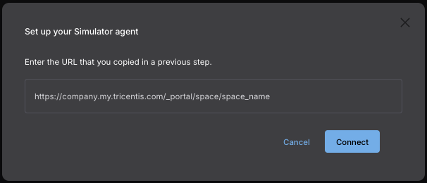

# ServiceFusion API Simulator Services/Tests

## About API Simulator

API Simulator is a Tricentis Cloud tool that provides service virtualization capabilities, allowing teams to:

- Simulate complex service interactions.
- Test applications without relying on actual services.
- Create reproducible testing environments.
- Accelerate development and testing processes.

## Setup

### API Simulator

1. Login to your Tosca Cloud tenant.

1. Click on the Downloads button in the upper righthand corner.

    

1. In the Downloads model download the necessary version for your OS.

    

1. Launch the API Simulator.

1. Open the [API Simulator UI](http://localhost:17070/ui).

1. Click on the Cloud icon in the upper righthand corner.

    

    

1. Click on the "Connect" button.

    

1. Enter your Cloud tenant URL and click "Connect".

    

    

1. The Cloud connection details should now looks like this:

    

### Import the .yml files

1. Clone the repository:

    ```bash
    git clone https://github.com/JStennett-Tricentis/API-Simulator-Tests.git
    ```

1. In the API Simulator UI, under the "`Inventory`" tab, click on the `+` button next to the Search field.

    

1. Click on the "Upload" button and select the repo folder that you cloned.

    

## Running the tests

1. In the API Simulator UI click on the "Play" tab.

    

1. Open one of the tests in the menu on the lefthand side, and click on the Play button in the upper righthand corner.

    

    

## References

- [About API Simulation](https://documentation.tricentis.com/tricentis_cloud/en/content/topics/sim_intro.htm)
- [How to Simulate Services Locally using IRIS Simulator](https://tricentis.atlassian.net/wiki/spaces/TPI/pages/1540686575/How+to+Simulate+Services+Locally+using+IRIS+Simulator)
- [ServiceFusion repo](https://github.com/Tricentis-Product-Integration/ServiceFusion)
